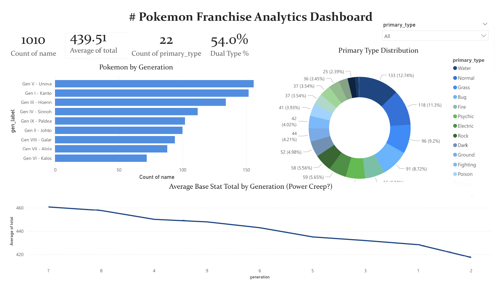
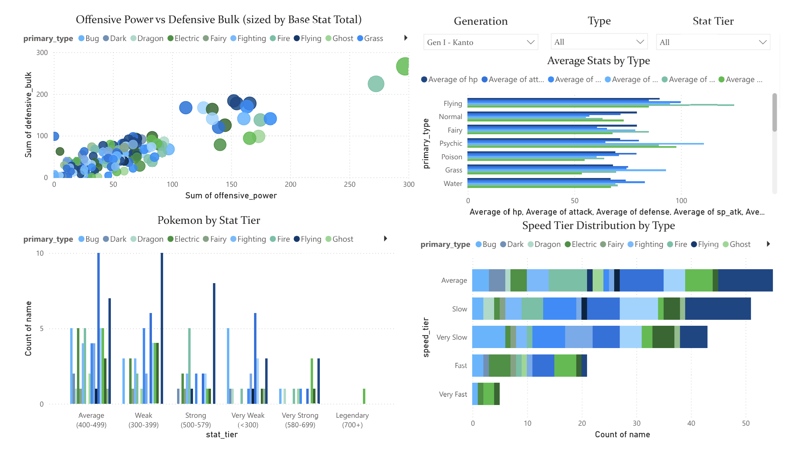
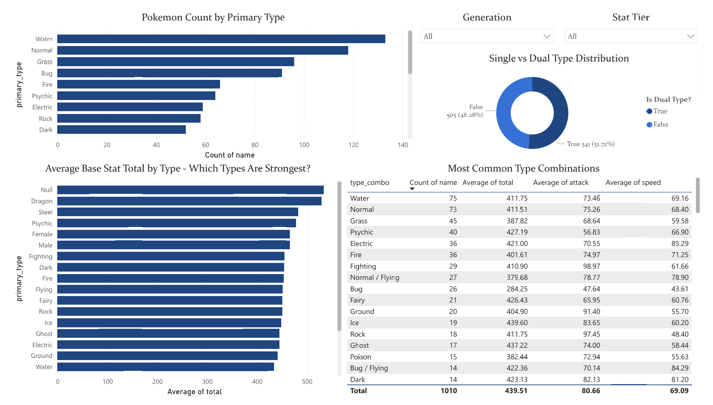
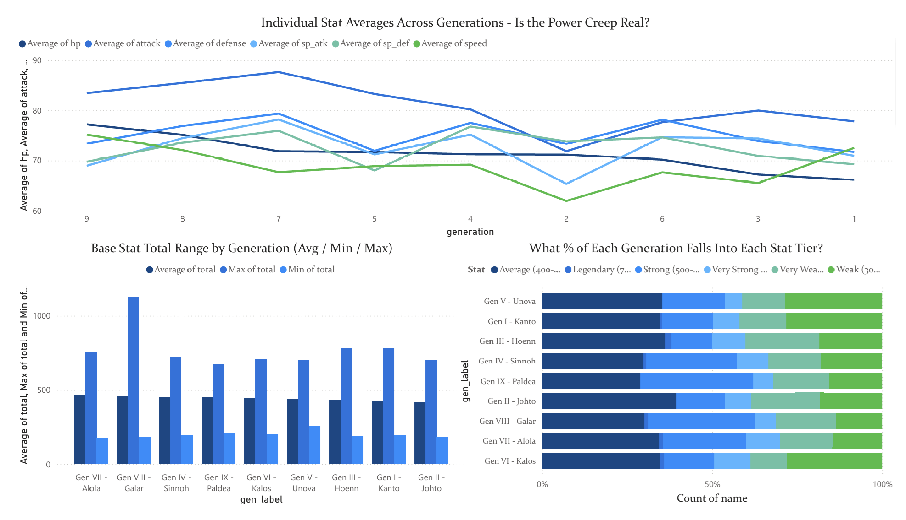
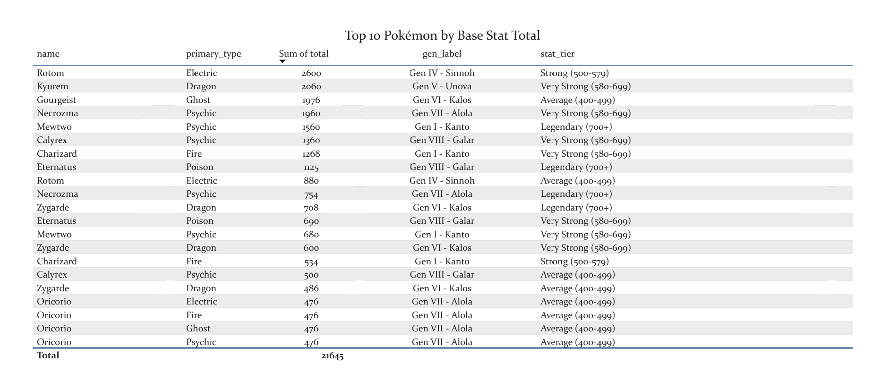

# 🔴 POKEMON FRANCHISE ANALYTICS DASHBOARD

An interactive Power BI dashboard analyzing **1,010 Pokemon** (1,028 as per the national pokedex) across all nine generations, exploring stat distributions, type effectiveness, power creep trends, and team-building insights.



## PROJECT OVERVIEW

The Pokemon franchise spans 9 generations and over 1,000 pokemons/pocket monsters, each with unique stats, types, and abilities. This dashboard transforms raw Pokemon data into interactive visualizations that answer the questions fans and game designers care about:

- How has the power level changed across generations?
- Which types are statistically strongest?
- Is there real evidence of "power creep"?
- What are the most common type combinations, and which are underrepresented?
- How do offensive vs defensive stats distribute across the roster?

## DASHBOARD PAGES

### Page 1: Overview
- KPI cards: total Pokemon count, average base stat total, dual type percentage, number of types
- Pokemon count by generation (bar chart)
- Primary type distribution (donut chart)
- Average base stat total trend across generations (line chart)
- Interactive type filter slicer

### Page 2: Stat Explorer
- Offensive Power vs Defensive Bulk scatter plot (sized by base stat total, colored by type)
- Average stats by type (multi-series grouped bar chart)
- Pokemon distribution by stat tier
- Speed tier breakdown by type
- Interactive slicers: generation, type, stat tier



### Page 3: Type Analysis
- Pokemon count by primary type (sorted bar)
- Single vs dual type distribution (donut)
- Most common type combinations table with average stats
- Average base stat total by type - which types are strongest



### Page 4: Power Creep
- Individual stat averages across all 9 generations (multi-line chart)
- Base stat total range by generation (avg/min/max)
- Stat tier proportions by generation (100% stacked bar)
- Top 10 strongest Pokemon table with Top N filtering


 

## KEY FINDINGS

### The Roster at a Glance
- **1,010 unique Pokémon** (**1,028** as per the national pokedex) across **9** generations with **22 primary types** and an average base stat total of **439.5**
- **54% are dual-typed** (541 out of 1,010), showing Game Freak's increasing preference for type complexity
- **Gen V (Unova) has the largest roster** (~156 Pokémon), while **Gen VI (Kalos) has the smallest** which is a deliberate shift toward quality over quantity in later generations

### Power Creep: Complicated, Not Linear
- The line chart reveals that **power creep is NOT a steady upward trend**. The average stats fluctuate across generations rather than climbing consistently
- Gen VII (Alola) shows the **highest individual stat spikes** (particularly in attack and special attack), while Gen I-III remain relatively consistent
- The stat tier breakdown shows every generation has a similar proportion of "Weak" and "Average" Pokémon, the creep happens at the **top end** with more Very Strong and Legendary-tier additions, not by inflating the average
- Gen VII (Alola) has the **highest max BST** (over 1,100) while Gen II (Johto) has one of the lowest ceilings

### Type Distribution Reveals Design Philosophy
- **Water (133, 12.7%)** and **Normal (118, 11.3%)** dominate the roster ie these are the "everyday" types that populate routes and oceans
- **Ice (25, 2.4%)** and **Ghost/Fairy (~36-37 each, 3.5%)** are the rarest types, making them feel special when encountered making this scarcity is a deliberate design choice
- **Dragon types** have the highest average BST by far, confirming their status as the elite type, balanced by their rarity and late-game availability

### Offensive vs Defensive Spectrum
- The scatter plot reveals distinct type clusters: **Dragon and Psychic** types cluster in the high-offense/high-bulk quadrant, while **Bug types** cluster in the low end of both
- **Fighting types have the highest average attack** (98.97) but moderate speed (61.66), fitting their "heavy hitter" design archetype
- **Electric types are the fastest** on average (85.29 speed), consistent with their lightning-themed identity
- **Normal / Flying** is the most common dual-type combo (27 Pokémon) ie the classic "bird" archetype

### Top 10 Strongest Pokémon
- The leaderboard is dominated by **variant forms** and **mega/special forms** - Rotom, Kyurem, Necrozma, Mewtwo, and Zygarde appear multiple times across different forms
- **Psychic and Dragon** types dominate the top 10, with Psychic appearing most frequently
- Notably, the highest BSTs come from later generations (Gen IV-VIII), supporting the power creep observation at the top end of the distribution

## TOOLS and TECHNOLOGIES

- **Power BI Desktop** - dashboard creation, DAX measures, interactive visualizations
- **DAX (Data Analysis Expressions)** - calculated columns, measures, and aggregations
- **Power Query** - data transformation, conditional columns, type detection
- **Python / pandas** - data preparation and enrichment script
- **Kaggle** - data source

### Power BI Skills Demonstrated
- Multi-page interactive dashboards
- DAX measures and calculated columns
- Conditional columns in Power Query
- Scatter plots, line charts, donut charts, stacked bars, tables
- Interactive slicers and cross-filtering
- Top N visual-level filtering
- Dark theme customization
- Page navigation

## PROJECT STRUCTURE

```
pokemon-powerbi-dashboard/
├── data/
│   ├── [original Kaggle CSVs]
│   └── pokemon_powerbi_ready.csv       # Enriched dataset for Power BI
├── powerbi/
│   └── Pokemon_Analytics_Dashboard.pbix # Power BI dashboard file
├── scripts/
│   └── prepare_data.py                 # Python data preparation script
├── images/                             # Dashboard screenshots
├── requirements.txt
└── README.md
```

## GETTING STARTED

### Prerequisites
- Power BI Desktop (free) - [Download here](https://powerbi.microsoft.com/desktop/)
- Python 3.10+ (for data preparation only)

### Setup
```bash
git clone https://github.com/rush2pranav/pokemon-powerbi-dashboard.git
cd pokemon-powerbi-dashboard

# Prepare the data
pip install pandas numpy
python scripts/prepare_data.py

# Open the dashboard
# Double-click powerbi/Pokemon_Analytics_Dashboard.pbix
```

### Dataset
Download from [Kaggle - Pokemon Dataset 2024](https://www.kaggle.com/datasets/ceebloop/pokmon-dataset-2024) and place CSV files in the `data/` folder. Run `prepare_data.py` to generate the enriched dataset.

## WHAT I LEARNED

- **Power BI's strength is interactivity** Unlike static Python charts, Power BI's cross-filtering means every visual is connected - clicking a type in one chart filters everything else instantly. This changes how you think about presenting data.
- **DAX is a different mindset from Python** DAX operates on table context and filter context rather than row-by-row operations. Understanding CALCULATE, ALL, and filter propagation is the key to unlocking Power BI's full potential.
- **Power Query is underrated** The ability to add conditional columns, transform data types, and build a repeatable data pipeline inside Power BI means less reliance on external scripts.
- **Data preparation is still 80% of the work** The Python script that enriched the raw data with stat tiers, type combos, and percentile rankings made the Power BI dashboard much more insightful than working with raw stats alone.

## POTENTIAL EXTENSIONS

- Add a Team Builder page where users select 6 Pokemon and see combined type coverage
- Integrate competitive usage data (Smogon tiers) for meta relevance analysis
- Add evolution chain analysis ie how much do stats improve through evolution?
- Create a "Which Starter Should You Pick?" page comparing all starter Pokemon
- Add ability data for ability-type synergy analysis
- Publish to Power BI Service for web-based interactive access

## LICENCE

This project is licenced under the MIT Licence - see the [LICENCE](LICENCE) file for details.

---

*Built as part of a Game Data Analytics portfolio. This project demonstrates Power BI dashboard development, DAX formulas, and data modeling skills applied to one of gaming's most iconic franchises. I am open to any and every feedback, please feel free to open an issue or connect with me on [LinkedIn](https://linkedin.com/in/phulpagarpranav/).*